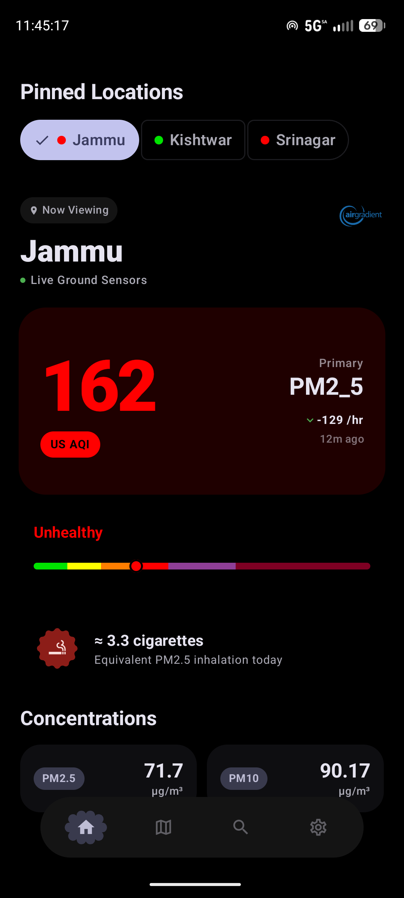
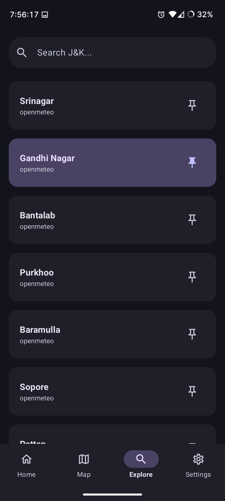
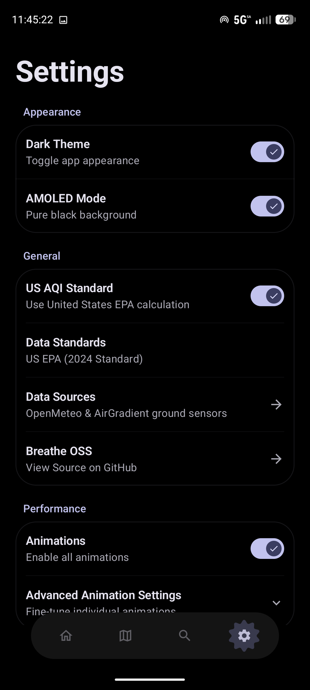

# Breathe (Android)

> *"Breathe, breathe in the air. Don't be afraid to care."* - **Pink Floyd**, *The Dark Side of the Moon*

<p align="center">
  
</p>

<p align="center">
  
  
  
</p>

**Breathe** is a modern, MD3 Android application designed to monitor real-time Air Quality Index (AQI) levels across Jammu & Kashmir. Built with **Kotlin** and **Jetpack Compose**, it provides a clean, fluid interface to track pollution levels using the Indian National Air Quality Index (NAQI) standards.

- Check the [**breathe api**](https://github.com/breathe-OSS/api?tab=readme-ov-file#how-the-aqi-is-calculated) repo to know how the AQI is calculated.

## Features

* **Material Design 3 Expressive**
* **Real-time Monitoring**
* **Indian NAQI Standards**
* **Detailed Breakdown**
* **A map with data laid across**

## Tech Stack

* **Language:** Kotlin
* **UI Framework:** Jetpack Compose (Material3)
* **Architecture:** MVVM (Model-View-ViewModel)
* **Networking:** Retrofit & Gson
* **Concurrency:** Kotlin Coroutines & Flow
* **Theme:** Dynamic Material You (Monet)

## Getting Started

### Prerequisites

* Android Studio Hedgehog or newer.
* JDK 17.
* A running instance of the **Breathe Backend** (Python/FastAPI).

### Installation

1. **Clone the repository:**

   ```bash
   git clone https://github.com/breathe-OSS/breathe

3. **Open in Android Studio.**
4. **Configure the API Endpoint:**
  - Open `app/src/main/java/com/sidharthify/breathe/BreatheApi.kt`.
  - Update `BASE_URL` to point to your backend server (e.g., your local IP if running locally).
4. **Build and Run:**
  - Sync Gradle files.
  - Select your device and click Run.

## (WIP) AQI Data Provider:
- **Open-Meteo:**

We are looking to setup certain custom physical sensors in some areas of Jammu, anyone willing to contribute can send a mail to wednisegit@gmail.com

## Credits & Developers
This project is fully Free & Open Source Software (FOSS).

## Built by:
1. [sidharthify](https://github.com/sidharthify) (Lead Dev)
2. [Flashwreck](https://github.com/Flashwreck) (Devops maintainer and designer)
